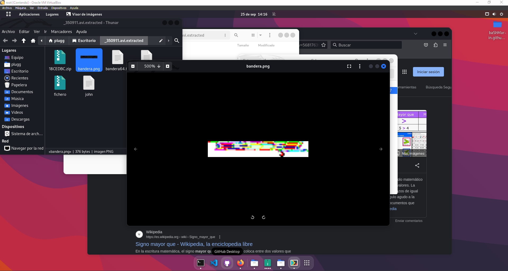
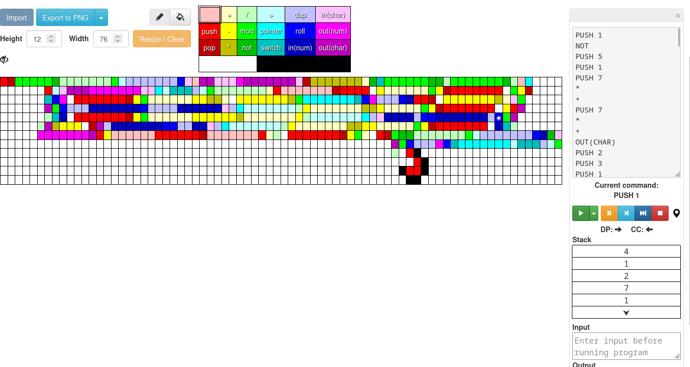

¡Hola!
Vamos a realizar un ejercicio de esteganografía. En el tendremos que descifrar un contenido de una imagen, en este caso un vídeo.

## HERRAMIENTAS UTILIZADAS
* BINWALK
* CEWL
* JONTHERIPPER
* ESOTERIC DESENCRYPT

* * *

## PRIMEROS PASOS
Comenzaremos visualizando el vídeo que vamos a analizar en este caso el nombre de nuestro archivo será `350911.avi`.
Como podemos observar el vídeo a simple vista no aparenta tener nada, pero nosotros sabemos que contiene contenido oculto detrás.


* *Preview del vídeo que podemos encontrar en el archivo .mp4*

En primer lugar usaremos la herramienta de binwalk, para descifrar contenido dentro de una imagen por ello usaremos el siguiente comando.

```bash
☁  Escritorio  binwalk 350911.avi -e

DECIMAL       HEXADECIMAL     DESCRIPTION
--------------------------------------------------------------------------------
26013116      0x18CEDBC       Zip archive data, at least v2.0 to extract, compressed size: 613, uncompressed size: 811, name: bandera64.txt
26013883      0x18CF0BB       End of Zip archive, footer length: 22
```

Nos extraerá un archivo en nuestro `Escritorio`. En este podemos ver un archivo llamado `bandera.txt`.

```bash
☁  Escritorio  ls
350911.avi  _350911.avi-0.extracted  _350911.avi.extracted  baShMarin.github.io
☁  Escritorio  cd _350911.avi.extracted 

☁  _350911.avi.extracted  ls
18CEDBC.zip  bandera64.txt

☁  _350911.avi.extracted  cat bandera64.txt 
UEsDBAoACQBjALpE5UyE1fPolAEAAHgBAAALAAsAYmFuZGVyYS5wbmcBmQcAAQBBRQMAAPKu8K6x
c7GJh/VmKva+f8JqD7Pe3X95ttenp+LwVVKiTrs1N450IIK7cjKsIYwqYBWiSwcClH2S51vh+L6/
xnICJFdIYuqD+sB282j0guUmoXbdIwU3dMtkYeUs/tOm7yd4TxHMfEQ2wM+i64R/iuhx9xvvh5PV
jnyPiKnjKPTQf9tH1XflKezQ8lHDAFPeEWZSMlRBaOwVWLywkiopyEYSuJGzJchCoRtiMX3fmfJX
8bD3SozBFIOPMjje/3/Xn6tVdmaaAVpAt8+iXu05VwXmmg8Ub7isi2KJBljiGMTQ+knFndW3gCEr
V3pk1OfNOGWAI09l5QXe6I+UKJZ5p9bpLi0fBbTHJCFcFu5y/IJHr9Vr5rzi6vpPU7p0ZtNJyYoK
EUB18DsmONtxc+xuqloJtzhRUQ5ZHRWumnfMk9Cw1tYT/KHa4gWh/GOVHLEAkizskRobAfanZ0OY
TfmYtjl/60UaL/sFkDYH4+uNt9MKLLiLR4WomoTq2Qi4o+EyzLDO0drgZXjsd1aN9s3EYkNY+Ug6
UEsHCITV8+iUAQAAeAEAAFBLAQIfAAoACQBjALpE5UyE1fPolAEAAHgBAAALAC8AAAAAAAAAIAAA
AAAAAABiYW5kZXJhLnBuZwoAIAAAAAAAAQAYAABwYYR+FNQBD0sSrJY51AHbTw9ChznUAQGZBwAB
AEFFAwAAUEsFBgAAAAABAAEAaAAAANgBAAAAAA==
```

Hemos encontrado una codificación que parece estar en base64 en `bandera.txt`.


* *Capturas realizadas desde mi máquina `Kali Linux`*

* * *

## PRIMERA FLAG
Hemos conseguido obtener una primera flag hacia nuestro objetivo, ya que sabemos que el archivo contiene algo detrás de un simple vídeo en formato `.AVI`
Lo que parece ser una codificación en `base64`, vamos a intentar decodificarlo con el siguiente comando ya que nuestro sistema Kali Linux tiene diccionarios en base64.

```bash
☁  _350911.avi.extracted  cat bandera64.txt | base64 -d
PK
 c�D�L����x

                  bandera.png�AE��s����f*���j���y�ק���UR�N�57�t ��r2�!�*`�K�}��[�����r$WHb���v�h��&�v�#7t�da�,�Ӧ�'xO�|D6�Ϣ���q�Վ|����(���G�w�)���Q�S�fR2TAh�X���*)�F���%�B�1}ߙ�W��J����28��ן�Uvf�Z@�Ϣ^�9W�o���b�X����Iŝշ�!+Wzd���8e�#Oe��菔(�y���.-��$!\�r��G��k����OS�tf�IɊ
@u�;&8�qs�n�Z �8QQY��w̓а��������c���,���gC�M���9�E�/��6�덷�
,��G��������2̰����ex�wV����bCX�H:P����xPK
 c�D�L����x
                  / bandera.png
 pa�~�K��9��OB�9��AEPKh�%  
```

Podemos mover este fichero hacia el escritorio para abrirlo y ver un poco mejor lo que contiene el archivo.

```bash
☁  _350911.avi.extracted  cat bandera64.txt | base64 -d > fichero
☁  _350911.avi.extracted  ls
18CEDBC.zip  bandera64.png  fichero
```

Dentro del archivo podremos encontrar un archivo `.png` con una contraseña.


En el vídeo podemos observar que nos hace mención a lo que parece ser un videojuego llamado `MonkeyIsland`, por lo tanto podemos buscar información en páginas a ver si encontrasemos una documentación o algún foro para crearnos nuestro propio diccionario con palabras relacionadas con el videojuego para intentar desencriptar el archivo: `bandera.txt`.

Para ello haremos uso de `CEWL`

### Usando CEWL
`CEWL` es una herramienta que nos ayuda con la creación de diccionarios a partir del contenido de una aplicación web, solamente tendremos que indicarle la cantidad de caractéres que queremos por contraseña.

Vamos a utilizar la URL: <https://www.eldiario.es/cultura/videojuegos/monkey-island-anos-secretos_1_2487406.html>

```bash
☁  _350911.avi.extracted  cewl -m 4 -w diccio -d 0 https://www.eldiario.es/cultura/videojuegos/monkey-island-anos-secretos_1_2487406.html
```
Y como podemos observar tenemos nuestro diccionario creado:

```bash
☁  _350911.avi.extracted  ls
18CEDBC.zip  bandera64.txt  diccio  fichero
```

A continuación usaremos la herramienta JohnTheRipper para romper la contraseña del fichero.zip.

### Usando JOHNTHERIPPER
Para poder usar JonTheRipper en este fichero, primero debemos de pasar nuestro fichero .zip a formato John, para ello usaremos el siguiente comando de `JohnTheRipper`.

```bash
☁  _350911.avi.extracted  zip2john fichero > john    
☁  _350911.avi.extracted  ls
18CEDBC.zip  bandera64.txt  diccio  fichero  john
```
Seguido de ello, usaremos el diccionario creado en la sección anterior para romper la contraseña del fichero john.

```bash
☁  _350911.avi.extracted  john --wordlist=./diccio john
Using default input encoding: UTF-8
Loaded 1 password hash (ZIP, WinZip [PBKDF2-SHA1 256/256 AVX2 8x])
Cost 1 (HMAC size) is 376 for all loaded hashes
Will run 6 OpenMP threads
Press 'q' or Ctrl-C to abort, almost any other key for status
grog             (fichero/bandera.png)     
1g 0:00:00:00 DONE (2023-09-25 14:13) 100.0g/s 147800p/s 147800c/s 147800C/s Noticias..TikTok
Use the "--show" option to display all of the cracked passwords reliably
Session completed. 
```
Como podemos observar nos ha dado la contraseña del fichero, en este caso sería `grog`.
Y podemos proceder a abrir nuestro fichero.zip sabiendo ya la contraseña.


Podemos ver a simple vista un fichero .png bastante diferente. Pero no nos da resultados de nada, por lo tanto seguiremos buscando información sobre el fichero.

* Le pasaremos un primer comando para ver si el contenido ocultase algo detrás, al igual que el vídeo.

```bash
☁  _350911.avi.extracted  binwalk bandera.png 

DECIMAL       HEXADECIMAL     DESCRIPTION
--------------------------------------------------------------------------------
0             0x0             PNG image, 76 x 12, 8-bit colormap, non-interlaced
```
No parece contener nada el archivo, aunque podemos indagar un poco más usando el comando `strings` para ver como está compuesto el archivo `png`

```bash
☁  _350911.avi.extracted  strings bandera.png 
IHDR
?PLTE
 pHYs
IDAT(
!$/8
IEND
```

* Debemos de deducir que el archivo está programado en otro lenguaje de programación diferente. Y podemos indagar sobre los lenguajes de programación o pasar nuestra foto por algún escáner para saber en que lenguaje de programación está desarrollado.

Indagando un poco podemos ver que el lenguaje `PIET` se asemeja mucho a nuestra imagen hallada, por lo tanto podemos visitar un intérprete de PIET para pasarle nuestra imagen y ver si tiene algún contenido oculto.
`https://gabriellesc.github.io/piet/`

Subiremos nuestro fichero `png` y esperaremos hasta que nos de un resultado el debugger.



Y como resultado podemos observar una cadena de texto con un nombre:
`THESevenSamurai`

## CONCLUSIONES DEL ALUMNO

* 1. La esteganografía puede llegar a ser un reto complicado.
* 2. Hay que observar muy bien y conocer el mundo de la programación para poder llegar a descifrar contenidos ocultos en archivos.
* 3. Con la ayuda de herramientas, como `strings` , `binwalk`... las tareas de esteganografía pueden llegar a ser algo menos complejas, pero en general pienso que son ejercicios de una dificultad elevada.


* * *

*__Esto es un trabajo realizado para MasterD con fines didácticos, no está enseñado para otro de sus usos.__*
